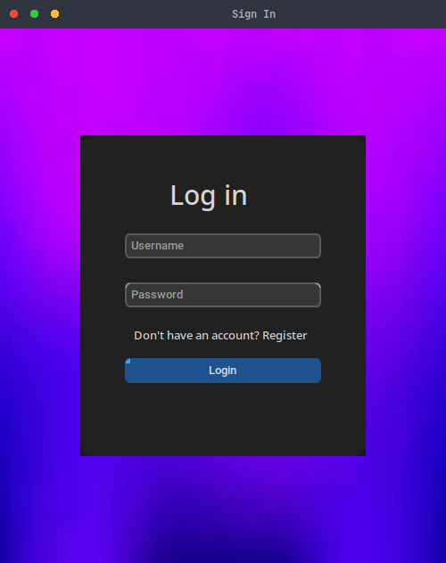
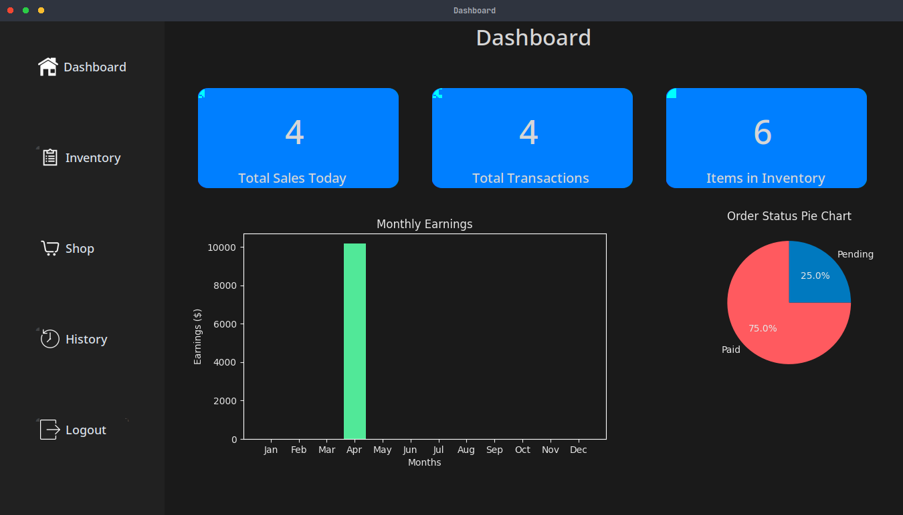
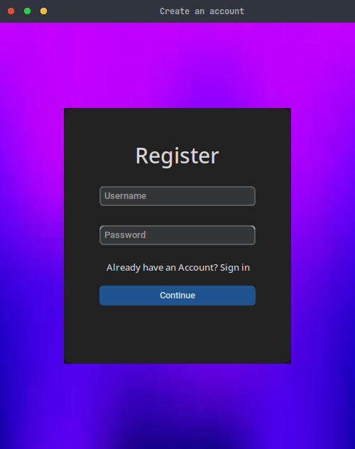
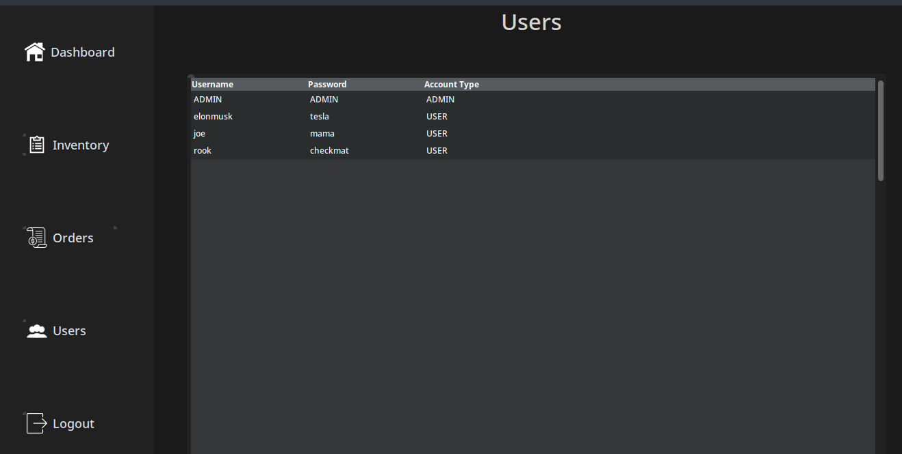
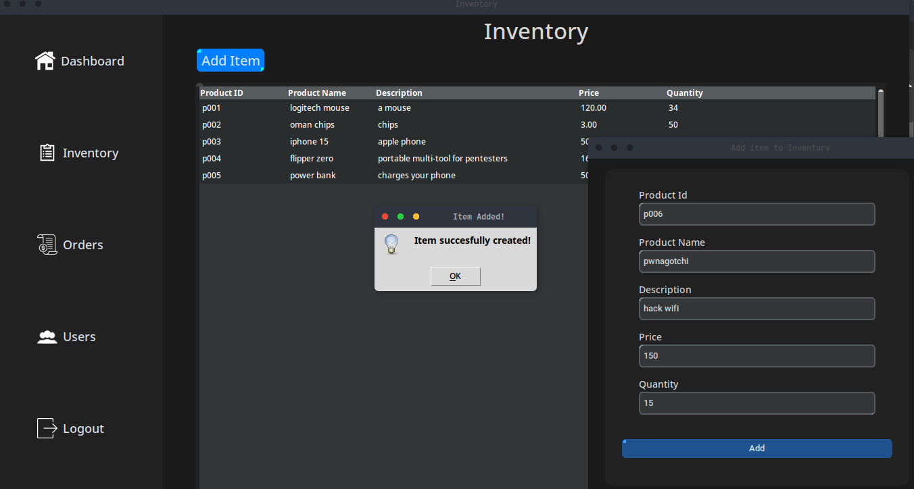
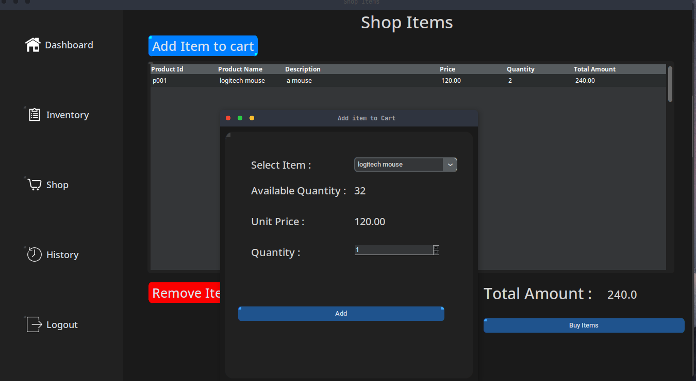
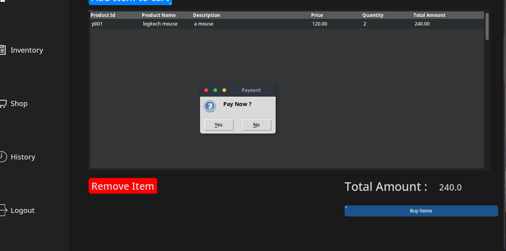
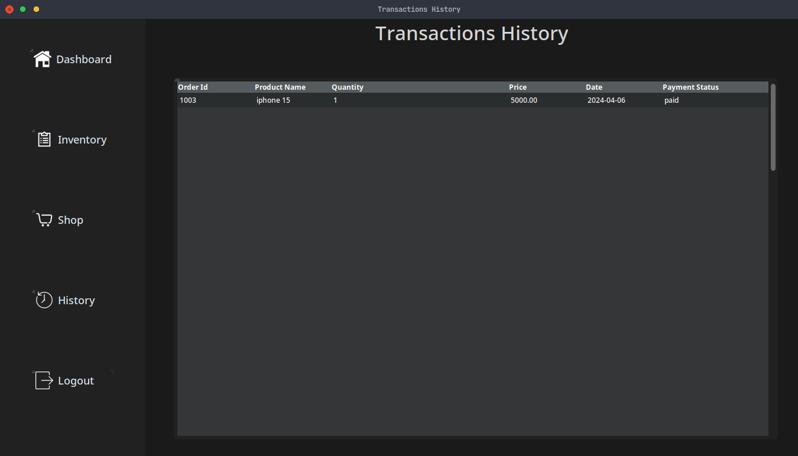

# Inventory Management System

This project is an inventory management system developed using customtkinter for the GUI, Matplotlib for data visualization, and MySQL for database management.

## Features

- User-friendly GUI built with customtkinter widgets.
- Data visualization using Matplotlib for insights into inventory trends.
- MySQL integration for efficient data storage and retrieval.

## Screenshots
</image> </image>
<details>
  <summary>View more</summary>
  <br>
    <p align="left">
    </image>
    </image>
    </image>
    </image>
    </image>
    </image>

    </p>

</details>


## Installation

1. Clone the repository to your local machine:

    ```bash
    git clone https://github.com/abidzzz/inventory-gui.git
    ```

2. Navigate to the project directory:

    ```bash
    cd inventory-management
    ```

3. Install the required dependencies:

    ```bash
    pip install -r requirements.txt
    ```

## Configuration

1. Replace user and passwd of mysql server in main.py

## Usage

1. Run the `main.py` file:

    ```bash
    python3 main.py
    ```

2. Use the GUI interface to manage your inventory.

## Notes

- Make sure to replace the `username` and `password` in the `main.py` file with your MySQL database credentials before running the application.

- This project is a basic implementation and can be extended with additional features and optimizations.

- A user can create an additional account to buy from inventory. But the default username for admin is ADMIN and password is ADMIN 

- The graph only appears in both user and admin dashboard when user purchases anything or else the graph wont be displayed .


## License

This project is licensed under the [MIT License](LICENSE).
